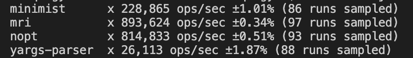

## Node.js 中如何收集和解析命令行参数

### 前言

  &emsp;&emsp;在开发 CLI（Command Line Interface）工具的业务场景下，离不开命令行参数的收集和解析。

  &emsp;&emsp;接下来，本文介绍如何收集和解析命令行参数。

### 收集命令行参数

  &emsp;&emsp;在 Node.js 中，可以通过 process.argv 属性收集进程被启动时传入的命令行参数：

```JavaScript
  // ./example/demo.js
  process.argv.slice(2);

  // 命令行执行如下命令
  node ./example/demo.js --name=xiaoming --age=20 man

  // 得到的结果
  [ '--name=xiaoming', '--age=20', 'man' ]
```

  &emsp;&emsp;由上述示例可以发现，Node.js 在处理命令行参数时，只是简单地通过空格来分割字符串。

  &emsp;&emsp;对于这样的参数数组，无法很方便地获取到每个参数对应的值，所以需要再进行一次解析操作。
### 命令行参数风格

  &emsp;&emsp;在解析命令行参数之前，需要了解一些常见的命令行参数的风格：

  - Unix 风格：参数以「-」（连字符）开头
  - GNU 风格：参数以「--」开头
  - BSD 风格：参数以空格分割

  &emsp;&emsp;Unix 风格有一个特殊的注意事项：**「-」后面紧邻的每一个字母多表示一个参数名**。

```s
  ls -al
```

  &emsp;&emsp;上述命令用来显示当前目录下所有的文件、文件夹并且显示它们详细的信息，等同于：

```s
  ls -a -l
```

  &emsp;&emsp;GNU 风格的参数以 「--」开头，一般后面会跟上一个单词或者短语，例如熟悉的 npm 安装依赖的命令：

```s
  npm install --save
```

  对于两个单词的情况，在 GNU 风格中，会通过「-」来分割，例如 npm 安装仅用于开发环境的依赖：

```s
  npm install --save-dev
```


  &emsp;&emsp;BSD 是加州大学伯克利分校开发的一个 Unix 版本。其与 Unix 的区别主要在于参数前面没有 「-」，这种风格暂时不讨论。


> -- 后面紧邻空格时，表示后面的参数不解析

### 解析命令行参数

```JavaScript
function parse(args = []) {
  // _ 属性用来保留不需要处理的参数字符串
  const output = { _: [] };

  for (let index = 0; index < args.length; index++) {
    const arg = args[index];
    
    if (isIgnoreFollowingParameters(output, args, index, arg)) {
      break;
    }
    
    if (!isParameter(arg)) {
      output._.push(arg);
    }

    ...
  }

  return output;
}

parse(process.argv.slice(2));
```

  &emsp;&emsp;接收到命令行参数数组之后，需要遍历数组，处理每一个参数字符串。

  &emsp;&emsp;isIgnoreFollowingParameters 方法主要用来判断单个「--」的场景，后续的参数字符串不再需要处理：

```JavaScript
function isIgnoreFollowingParameters(output, args, index, arg) {
  if (arg !== '--') {
    return false;
  }
  output._ = output._.concat(args.slice(++index));
  return true;
}
```

  &emsp;&emsp;接下来，如果参数字符串不以「-」开头，同样也不需要处理，参数的形式以 Unix 和 GNU 风格为主：

```JavaScript
function isParameter(arg) {
  return arg.startsWith('-');
}
```

  &emsp;&emsp;参数的表现形式主要分为以下几种：

  - "--name=xiaoming": 参数名为 name，参数值为 xiaoming
  - "-abc=10": 参数名为 a，参数值为 true；参数名为 b，参数值为 true；参数名为 c，参数值为 10
  - "--save-dev": 参数名为 save-dev，参数值为 true
  - "--age 20"：参数名为 age，参数值为 20

```JavaScript
  let hyphensIndex;
  for (hyphensIndex = 0; hyphensIndex < arg.length; hyphensIndex++) {
    if (arg.charCodeAt(hyphensIndex) !== 45) {
      break;
    }
  }

  let assignmentIndex;
  for (assignmentIndex = hyphensIndex + 1; assignmentIndex < arg.length; assignmentIndex++) {
    if (arg[assignmentIndex].charCodeAt(0) === 61) {
      break;
    }
  }
```

  &emsp;&emsp;利用 Unicode 码点值找出连字符和等号的下标值，从而根据下标分割出参数名和参数值：

```JavaScript
  const name = arg.substring(hyphensIndex, assignmentIndex);

  let value;
  const assignmentValue = arg.substring(++assignmentIndex);
  if (assignmentValue) {
    value = assignmentValue;
  } else if (index + 1 === args.length) {
    value = true;
  } else if (('' + args[index + 1]).charCodeAt(0) === 45) {
    value = args[++index];
  } else {
    value = true;
  }
```

  &emsp;&emsp;处理参数值的时候，需要考虑参数赋值的四种场景。

  &emsp;&emsp;由于 Unix 风格中每一个字母都代表一个参数，所以还需针对该场景进行适配：

```JavaScript
  // 「-」or「--」
  const arr = hyphensIndex === 2 ? [name] : name;
  for (let keyIndex = 0; keyIndex < arr.length; keyIndex++) {
    const _key = arr[keyIndex];
    const _value = keyIndex + 1 < arr.length || value;
    handleKeyValue(output, _key, _value);
  }
```

  &emsp;&emsp;如果是 Unix 风格，则需要将单个字母拆分开，并且**手动传递的参数值应该赋值给最后一个参数**。

  &emsp;&emsp;最后针对参数的赋值操作，需要考虑到**多次赋值**的情况：

```JavaScript
function handleKeyValue(output, key, value) {
  const oldValue = output[key];
  if (Array.isArray(oldValue)) {
    output[key] = oldValue.concat(value);
    return;
  }

  if (oldValue) {
    output[key] = [oldValue, value];
    return;
  }

  output[key] = value;
}
```

### 别名机制

  &emsp;&emsp;比较优秀的 CLI 工具在参数的解析上都支持参数名的简写，例如使用 npm 安装开发环境依赖时，你可以选择这种完整的写法：

```s
  npm install --save-dev webpack
```

  &emsp;&emsp;同样，你也可以使用下面这种简写方式：

```s
  npm install -D webpack
```

  &emsp;&emsp;从使用方来说 -D 和 --save-dev 是两种方式，但是从 CLI 工具的开发者来说，最终处理逻辑时肯定只以一个参数名为标准，所以对于一个命令行参数解析库来说，其结果得包含所有的情况：

```s
  npm install --save-dev webpack

  # 解析的结果
  { 'save-dev': true, 'D': true }
```

  &emsp;&emsp;以上文的解析方法为例，需要添加额外的选项参数，加入 alias 属性来声明简写属性的映射表：

```JavaScript
  parse(process.argv.slice(2), {
    alias: {
      'save-dev': 'S'
    }
  })
```

  &emsp;&emsp;上述方式符合正常的理解：设置参数对应的简写名称。但这是一个**单向查找关系**，需要转化为：

```json
  "alias": {
    "save-dev": ["s"],
    "s": ["save-dev"]
  }
```

  &emsp;&emsp;因为对于使用者来说，只会选择一种方式传递参数，那么在参数解析完成之后，给相关联的别名再赋值一次即可：

```JavaScript
function parse(args = [], options = {}) {
  const output = { _: [] };

  const { alias } = options;

  const hasAlias = alias !== void 666;

  if (hasAlias) {
    Object.keys(alias).forEach(key => {
      alias[key] = toArr(alias[key]);
      alias[key].forEach((item, index) => {
        (alias[item] = alias[key].concat(key)).splice(index, 1);
      })
    })
  }

  // 省略解析代码
  ...

	if (hasAlias) {
    Object.keys(output).forEach(key => {
      const arr = alias[key] || [];
      arr.forEach(sub => output[sub] = output[key])
    })
	}

  return output;
}
```

  &emsp;&emsp;除了别名的处理之外，还有一些可以优化的地方：

  - 参数值的类型约束
  - 参数的默认值设定

### 成熟的解析库

  &emsp;&emsp;针对一些成熟的命令行参数解析库可以采用基准测试查看它们的解析效率：

```JavaScript
const nopt = require('nopt');
const mri = require('mri');
const yargs = require('yargs-parser');
const minimist = require('minimist');
const { Suite } = require('benchmark');

const bench = new Suite();
const args = ['--name=xiaoming', '-abc', '10', '--save-dev', '--age', '20'];

bench
	.add('minimist     ', () => minimist(args))
	.add('mri          ', () => mri(args))
	.add('nopt         ', () => nopt(args))
	.add('yargs-parser ', () => yargs(args))
	.on('cycle', e => console.log(String(e.target)))
	.run();
```

  

  &emsp;&emsp;本文的内容主要基于解析效率最高的 mri 库的源码来阐述的，感兴趣的同学可以学习其源码。（顺便吐槽一下：嵌套三元操作符可读性真的很差。。）

  &emsp;&emsp;虽然上述基准测试中 minimist 效率并不很好，但是其覆盖了比较全的参数输入场景。（这里的测试用例没有覆盖那么全）
### 写在最后

  &emsp;&emsp;最后，**如果本文对您有帮助，欢迎关注（公众号【漫谈大前端】）、点赞、转发 ε=ε=ε=┏(゜ロ゜;)┛。**


  

